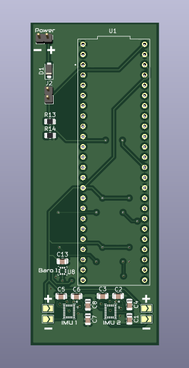
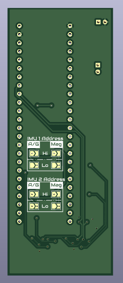

# IMU Testbed
This pcb was created with the goal of allowing us to test & validate different configurations for IMU's and barometers. It currently holds 2 LSM9DSLTR 9-axis IMUs and 1 LPS22HB barometer, and is controlled by a Teensy 4.1. On the back of the pcb are solder jumpers for configuring the address of the accelerometer, gyroscope, and magnitometer for each IMU. On the front are 2 more solder jumpers which allow for controlling the state of the DEN_A/G pin on both IMUs, to either set it floating, high, or low.

## Bill of Materials
- Teensy 4.1 (1x)
- 10uF Capacitor 0805 (4x)
- 100nF Capacitor 0805 (5x)
- [Schottky Diode](https://www.digikey.com/en/products/detail/micro-commercial-co/SMD110PL-TP/2698532) (1x)
- JST connector (2x)
- 1.2k Resistor 0805 (1x)
- 4.4k Resistor 0805 (1x)
- [LSM9DS1TR](https://www.digikey.com/en/products/detail/stmicroelectronics/LSM9DS1TR/4988083?s=N4IgTCBcDaIDIGUCyBOAIggjCAugXyA) (2x)
- [LPS22HB](https://www.digikey.com/en/products/detail/stmicroelectronics/LPS22HBTR/5799910?s=N4IgTCBcDaIDIAUDKYwAkBCIC6BfIA) (1x)
- [Buzzer](https://www.adafruit.com/product/160) (1x)